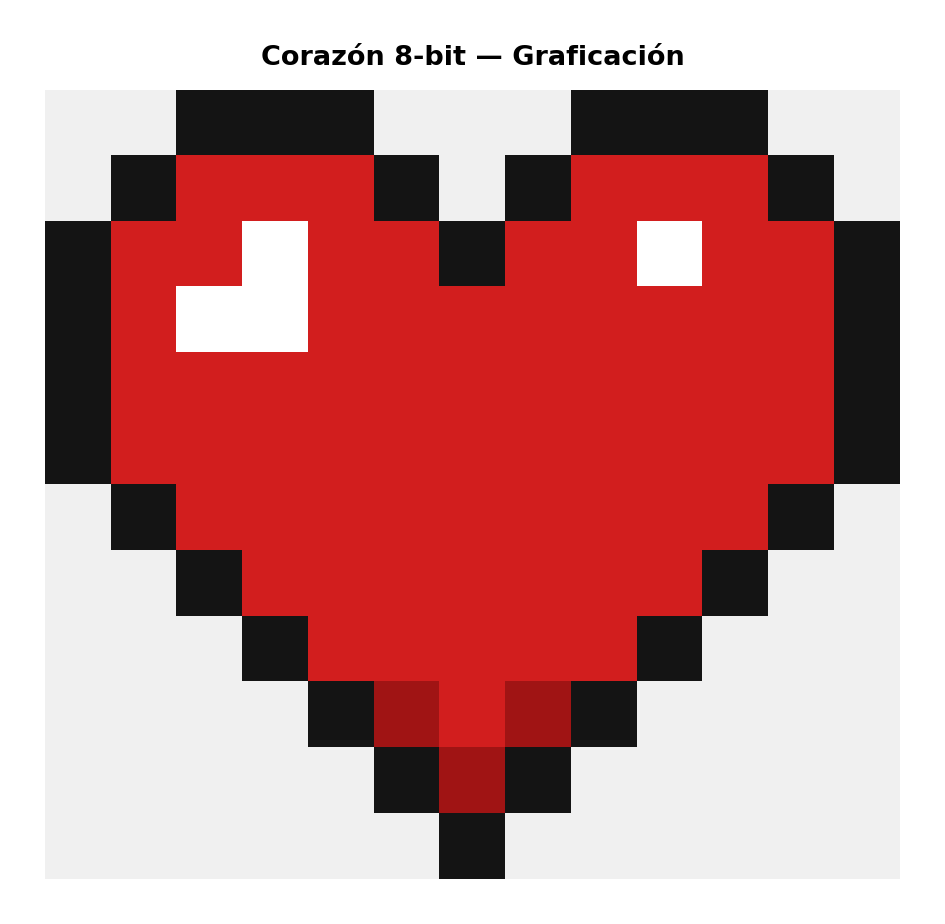

# Corazón Pixel Art 8-bit 🎮

Proyecto para la materia de **Graficación** del TecNM Morelia. Es un corazón estilo Minecraft/retro hecho con Python.



## Cómo funciona

El programa dibuja un corazón pixel por pixel usando una matriz donde cada número representa un color. Usa `numpy` para manejar la imagen como un arreglo y `matplotlib` para mostrarla y guardarla.

La idea es simple: defines el dibujo en una cuadrícula (como una hoja cuadriculada), le asignas colores, y lo renderizas.

```
N = negro (contorno)
R = rojo
O = rojo oscuro (sombra en la punta)
B = blanco (brillo)
_ = vacío (fondo)
```

## Cómo ejecutarlo

```bash
pip install numpy matplotlib
python src/corazon_pixel.py
```

La imagen se guarda en `output/corazon_pixel.png`.

## Estructura

```
├── src/
│   └── corazon_pixel.py
├── output/
│   └── corazon_pixel.png
├── requirements.txt
├── .gitignore
└── README.md
```

## Mi experiencia haciendo esto

Nunca había dibujado nada con código. Siempre que pensaba en "gráficos" me imaginaba herramientas como Photoshop o Illustrator, no una terminal de Python. Así que cuando nos dejaron esta práctica, la verdad no sabía ni por dónde empezar.

Lo primero que hice fue investigar cómo funciona una imagen a nivel de píxeles. Resultó que una imagen es básicamente una matriz — cada celda tiene un valor de color. Eso lo conecté con lo que vimos en clase sobre cómo los monitores despliegan información: una cuadrícula de puntos de luz, cada uno con un valor RGB.

Decidí hacer un corazón estilo Minecraft porque me pareció un diseño sencillo de representar en una cuadrícula pequeña (13 columnas por 12 filas). El truco estuvo en pensar el dibujo como si fuera una hoja de cuadrícula: fui llenando celda por celda qué color iba en cada posición.

### Lo que me costó trabajo

Lo más confuso al principio fue entender cómo `numpy` maneja los ejes. Uno pensaría que `imagen[x, y]` es como en matemáticas (x horizontal, y vertical), pero no — es `imagen[fila, columna]`, o sea `[y, x]`. Me tardé un rato en caer en cuenta de por qué mi dibujo salía raro.

También me atoré un poco con las dependencias. Tengo Python 3.14 que es bastante nuevo y no todas las versiones de matplotlib son compatibles. Tuve que crear un entorno virtual para que todo funcionara bien, lo cual no tiene nada que ver con graficación pero es parte del proceso real de programar.

Subir el proyecto a GitHub fue otra cosa. No uso git todos los días, entonces tuve que repasar los comandos básicos: `git init`, `git add`, `git commit`, `git push`. Lo más útil fue hacer el `.gitignore` antes del primer commit para no subir el `venv/` ni los archivos de caché de Python.

### Lo que aprendí

- Una imagen digital es una matriz de píxeles, cada uno con un valor de color
- La escala más básica es definir colores como arreglos `[R, G, B]`
- El renderizado con `interpolation='nearest'` es lo que le da el efecto pixelado real
- El orden de filas/columnas en numpy es lo contrario a lo que uno esperaría
- Planear el dibujo en papel (o en tu cabeza como cuadrícula) antes de codificar ahorra mucho tiempo

## Datos

**Alumno:** José Roberto García Correa — 23121108  
**Materia:** Graficación (SCC-1010)  
**Profesor:** Eduardo Alcaraz  
**Instituto:** TecNM Morelia